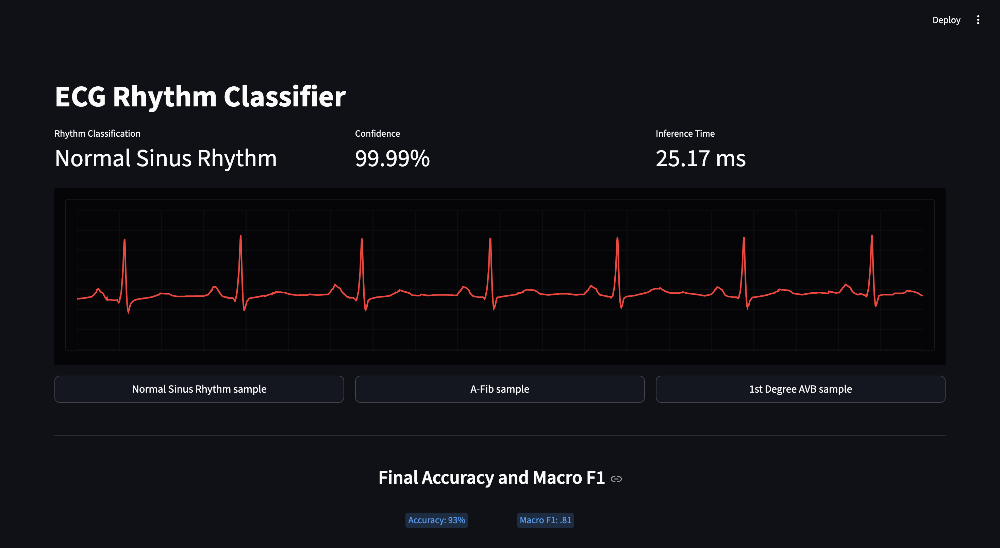
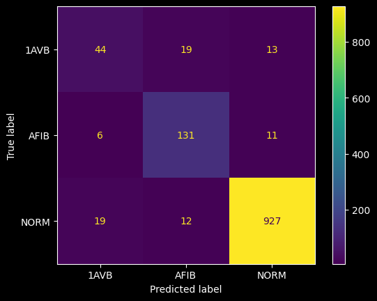

# ECG Rhythm Classifier — On-Device Arrhythmia Detection

A lightweight 1D Convolutional Neural Network for real-time ECG rhythm classification, designed for deployment directly on resource-constrained edge devices. This project addresses a genuine clinical gap: non-specialist nursing staff in low-acuity units correctly identify arrhythmias only ~55% of the time, while centralized monitoring introduces communication delays in environments where seconds matter.

The model runs entirely on-device — no PHI is ever transmitted to an external server — and produces a rhythm classification with a confidence score in **under 50ms** on development hardware, targeting sub-1s inference on constrained Cortex-M4 telemetry nodes.

> This project was developed as a BS Computer Science capstone at Western Governors University (ABET-accredited).

---



## Performance

| Metric | Result |
|--------|--------|
| Overall Accuracy | **93%** |
| Macro F1 Score | **0.81** |
| Inference Time (M4 dev hardware) | **< 50ms** |
| Full Model Size | **< 1 MB** |
| Quantized Model Size (int8) | **< 100 KB** |

### Per-Class Results

| Class | Precision | Recall | F1-Score |
|-------|-----------|--------|----------|
| Normal Sinus Rhythm (NORM) | 0.97 | 0.97 | **0.97** |
| Atrial Fibrillation (AFIB) | 0.81 | 0.89 | **0.85** |
| 1st Degree AV Block (1AVB) | 0.64 | 0.58 | **0.61** |

The lower 1AVB F1 reflects the original class imbalance in the PTB-XL dataset (594 records vs. 7,534 NORM) and is a known limitation. Data augmentation was applied to partially address this — see [Dataset](#dataset) section.

Cross-validation (5-fold) confirmed generalizability: **mean accuracy 90.5% ± 1.5%**.



---

## Rhythm Classes

| Label | Description | Clinical Significance |
|-------|-------------|----------------------|
| `NORM` | Normal Sinus Rhythm | Baseline reference |
| `AFIB` | Atrial Fibrillation | Risk of hemodynamic instability, stroke, rapid ventricular response |
| `1AVB` | 1st Degree AV Block | Early indicator of medication toxicity (beta blockers, digoxin, calcium channel blockers) |

---

## System Architecture

```
┌─────────────────────────────────────────────────────────────┐
│                     Telemetry Node (Edge Device)            │
│                                                             │
│  Lead II ECG Signal                                         │
│       │                                                     │
│       ▼                                                     │
│  Rolling Buffer (5000 samples @ 500Hz = 10 seconds)         │
│       │                                                     │
│       ▼                                                     │
│  Format Tensor (5000, 1)                                    │
│       │                                                     │
│       ▼                                                     │
│  1D-CNN Inference (optimized_ecg_model.keras / .tflite)     │
│       │                                                     │
│       ▼                                                     │
│  Classification + Confidence Score                          │
│       │                                                     │
│       ├── Confidence ≥ 80% → Output: NORM / AFIB / 1AVB     │
│       └── Confidence < 80% → Output: "Unclassified Rhythm"  │
│                          (prompts further clinical review)  │
└─────────────────────────────────────────────────────────────┘
        ↑ All inference on-device. No PHI ever transmitted. ↑
```

---

## Model Architecture

A 1D-CNN was selected for this deployment context for three reasons: ECG data is inherently temporal and 1D-CNNs extract local patterns directly from raw signals without manual feature engineering; they are computationally efficient compared to 2D image-based approaches; and they maintain a small enough footprint for Cortex-M4 class hardware after quantization.

```
Input (5000, 1)
    │
    ├── Conv1D(64 filters, kernel=9, relu)
    ├── MaxPooling1D(pool_size=2)
    │
    ├── Conv1D(64 filters, kernel=9, relu)
    ├── MaxPooling1D(pool_size=2)
    │
    ├── Conv1D(64 filters, kernel=9, relu)
    ├── MaxPooling1D(pool_size=2)
    │
    ├── GlobalAveragePooling1D()
    ├── Dense(64, relu)
    └── Dense(3, softmax) → [NORM, AFIB, 1AVB] + confidence score
```

Hyperparameters were optimized using **Keras Tuner** over 30 trials with early stopping and model checkpointing to prevent overfitting. Larger kernel sizes showed the strongest impact on performance, consistent with the importance of long-range temporal dependencies in ECG rhythm features.

**Quantization:** Post-training Float32 → int8 quantization via TensorFlow Lite reduces model size by ~90% with minimal accuracy impact, enabling deployment on constrained Cortex-M4/M33 class devices.

**Known limitation:** The final softmax layer performs well on in-distribution rhythms but may assign high confidence to out-of-distribution data by forcing classification into the nearest known class. A future improvement would be adding an energy-based out-of-distribution detector as a secondary gate.

---

## Dataset

**PTB-XL** — publicly available via PhysioNet

- 21,837 ten-second 12-lead ECG records from 18,885 patients at 500 Hz
- Single-channel input: **Lead II only** — standard for rhythm analysis
- Input tensor shape: `(5000, 1)`
- Stratified 10-fold split per dataset documentation:
  - Folds 1–8: Training
  - Fold 9: Validation
  - Fold 10: Held-out test set

**Class distribution before augmentation:**

| Class | Records |
|-------|---------|
| NORM | 7,534 |
| AFIB | 1,173 |
| 1AVB | 594 |

**Augmentation techniques applied to minority classes:**
- Gaussian noise injection
- Amplitude scaling
- Time shifting
- Baseline wander simulation

**Final training distribution:** NORM: 7,534 · AFIB: 6,900 · 1AVB: 6,300

> Wagner, P., et al. (2020). PTB-XL, a large publicly available electrocardiography dataset. *Scientific Data, 7*, 154. https://doi.org/10.1038/s41597-020-0495-6
>
> Wagner, P., et al. (2022). PTB-XL (version 1.0.3). *PhysioNet*. https://doi.org/10.13026/kfzx-aw45

---

## Project Structure

```
ecg-rhythm-classifier/
├── model/
│   ├── notebooks/
│   │   ├── ptbxl_data_cleaning.ipynb       # Dataset filtering, lead extraction, augmentation
│   │   ├── ecg_model_training.ipynb        # Model architecture and training
│   │   └── ecg_model_optimization.ipynb    # Hyperparameter tuning and quantization
│   ├── tuning_results/                     # Keras Tuner hyperparameter logs
│   ├── ecg_model.keras                     # Base trained model
│   ├── optimized_ecg_model.keras           # Tuned full model (< 1MB)
│   └── quantized_ecg_model.tflite          # Quantized model for edge deployment (< 100KB)
├── rhythm_sample/
│   ├── NSR_sample.npy                      # Normal Sinus Rhythm test sample
│   ├── AFIB_sample.npy                     # Atrial Fibrillation test sample
│   └── AVB_sample.npy                      # 1st Degree AVB test sample
├── final_confusion_matrix.png
├── interface.py                            # Streamlit POC interface
├── .gitignore
└── README.md
```

---

## Running the POC Interface

**Prerequisites**

```bash
pip install streamlit tensorflow numpy
```

**Launch**

```bash
streamlit run interface.py
```

The interface loads sample ECG data for all three rhythm classes and allows you to:
- Select a rhythm sample (NSR, A-Fib, or 1st Degree AVB)
- View a scrolling ECG waveform visualization
- See the model's rhythm classification, confidence score, and inference time in real time

> All inference is performed locally. No data is transmitted externally.

---

## Tech Stack

| Component | Detail |
|-----------|--------|
| Language | Python 3.13.x |
| Model Training | TensorFlow / Keras, Keras-Tuner |
| Edge Deployment | TensorFlow Lite (int8 quantized) |
| Target Hardware | STM32 Cortex-M4/M33 class telemetry nodes |
| Data Processing | NumPy, Pandas, WFDB |
| Evaluation | Scikit-Learn, Matplotlib |
| Interface | Streamlit |

---

## Regulatory Context

This project was developed with clinical deployment constraints in mind:

- **HIPAA by design:** All inference on-device; no PHI transmission
- **ISO 14971:** Risk-informed design decisions throughout (confidence thresholding, unclassified rhythm flagging, model drift monitoring plan)
- **IEC 62304:** Sequential development and validation methodology consistent with Software as a Medical Device (SaMD) guidance